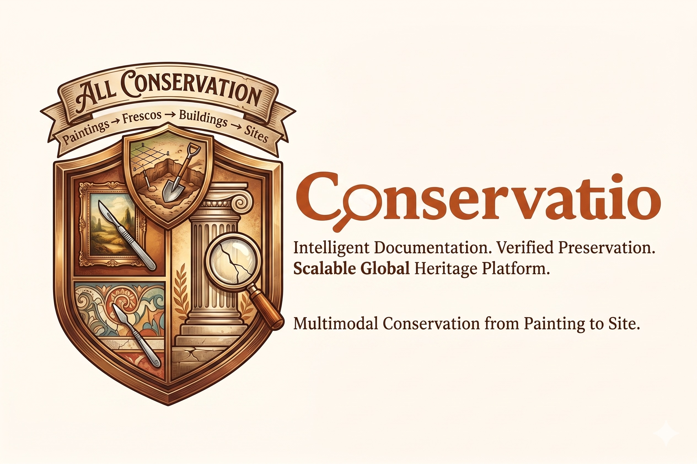
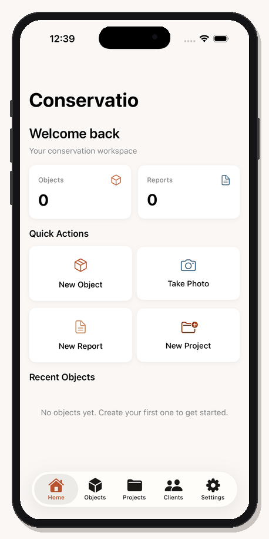
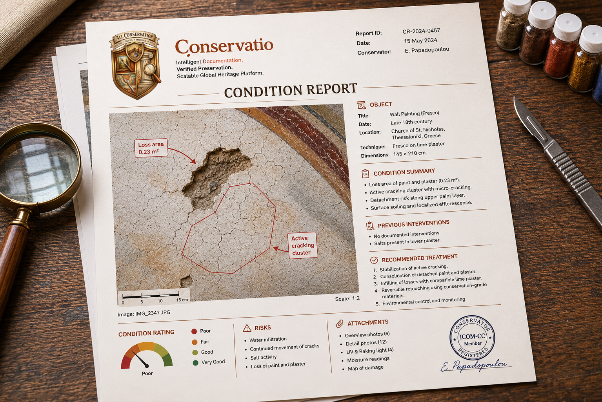
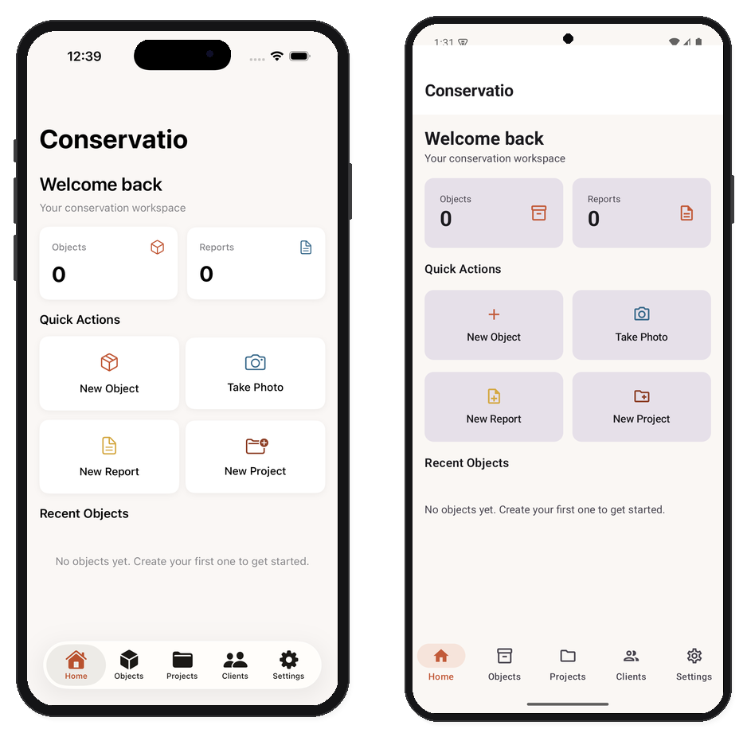
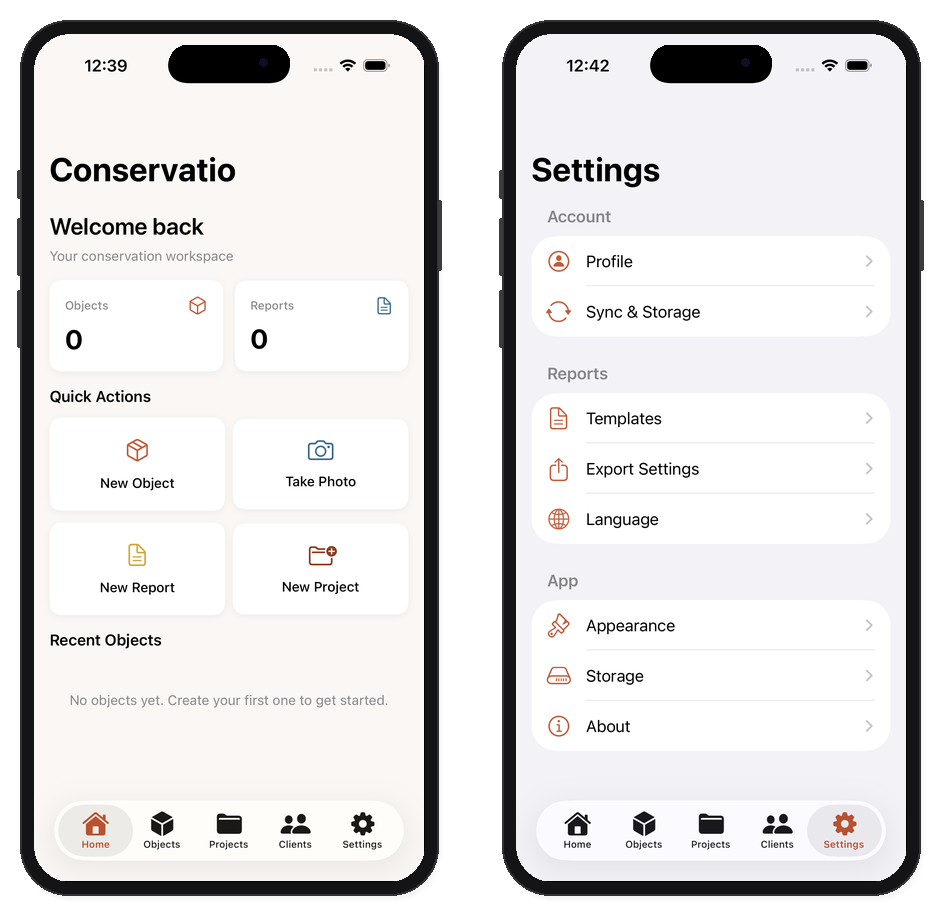

<p align="center">
  
  
  
  
  
</p>

<p align="center">
  
</p>

<h1 align="center">Conservatio</h1>

<p align="center">
  <strong>Document heritage. Protect history.</strong>
</p>

<p align="center">
  <a href="https://conservatio.peterdsp.dev">Website</a> · <a href="https://github.com/peterdsp/conservatio/releases">Releases</a> · <a href="docs/CASE_STUDY.md">Case Study</a>
</p>

<p align="center">
  
</p>

Conservatio is a professional conservation documentation platform for cultural heritage. It replaces Word templates, scattered photos, and manual reporting with structured, searchable, offline-ready documentation that exports to beautiful PDF reports.

Built for private conservators, small museums, galleries, churches, archaeological teams, and heritage authorities.

<p align="center">
  
</p>

## Screenshots

<p align="center">
  
</p>

<p align="center">
  <em>iOS (iPhone 17) and Android (Pixel 8) running side by side</em>
</p>

## What Conservatio Does

**Condition Reports.** Structured damage checklists, controlled vocabulary, condition ratings, and annotated photos. Export professional branded PDFs in multiple languages.

**Object Management.** Register conservation objects with type, materials, dimensions, photos, location, and ownership. Track the full lifecycle from acquisition to restoration.

**Project Tracking.** Organize objects, reports, and clients into projects. Track status, timelines, budgets, and treatment progress.

**Image Annotation.** Mark cracks, paint loss, corrosion, and other damage directly on photos. Each annotation links to damage type, severity, and notes.

**Offline-First.** Works in churches, basements, excavation sites, and anywhere without signal. Everything syncs when you reconnect.

**Self-Hosted.** Your conservation data stays on your own hardware. No cloud dependency. Runs on a Raspberry Pi.

## Platforms

| Platform | Technology | Status |
|----------|-----------|--------|
| **iOS** | SwiftUI, iOS 17+ | In development |
| **Android** | Jetpack Compose, Material 3 | In development |
| **Web** | Next.js, TypeScript, Tailwind | In development |
| **Server** | Ktor, PostgreSQL, JWT Auth | Running on Raspberry Pi |

## Screenshots

<p align="center">
  
</p>

<p align="center">
  <em>Dashboard and Settings (iPhone 17, iOS 26.1)</em>
</p>

## Who Is This For

- **Private conservators** who spend too much time formatting Word documents
- **Small museums** that need affordable collection and conservation management
- **Churches and heritage sites** that lack structured inventory and maintenance records
- **Galleries and collectors** that need condition reports for loans, insurance, and transport
- **Archaeological teams** that document under pressure in the field with unstable connectivity

## Roadmap

| Phase | Features | Status |
|-------|----------|--------|
| **1** | Object profiles, condition reports, damage checklists, photo capture, PDF export, offline storage | In progress |
| **2** | Before/after comparison, report templates, team collaboration, client portal | Planned |
| **3** | AI-assisted drafting, GIS for archaeological sites, environmental monitoring, Spectrum compliance | Future |

## Architecture

```
conservatio/
├── shared/       KMP shared module (domain models, repositories, API client, SQLDelight)
├── iosApp/       Native iOS app (SwiftUI)
├── androidApp/   Native Android app (Jetpack Compose)
├── web/          Web companion (Next.js)
├── server/       API server (Ktor + PostgreSQL)
├── site/         Landing page (conservatio.peterdsp.dev)
└── docs/         Architecture, design system, case study
```

| Layer | Technology |
|-------|-----------|
| Shared logic | Kotlin Multiplatform, Coroutines, Serialization |
| iOS | SwiftUI, NavigationStack, PDFKit |
| Android | Jetpack Compose, Material 3, Navigation |
| Web | Next.js 14, React 18, TypeScript, Tailwind CSS |
| Server | Ktor 3.0, Exposed ORM, PostgreSQL, JWT Auth |
| Local DB | SQLDelight (offline-first) |
| Hosting | Self-hosted on Raspberry Pi 4, Docker Compose |

## License

Copyright (c) 2026 Petros Dhespollari. All rights reserved.

This software is proprietary. Source code is visible for transparency and educational review. Commercial use, redistribution, derivative works, and use in competing products are prohibited without written permission.

For commercial licensing inquiries, contact via [peterdsp.dev](https://peterdsp.dev).

See [LICENSE](LICENSE) for full terms.
